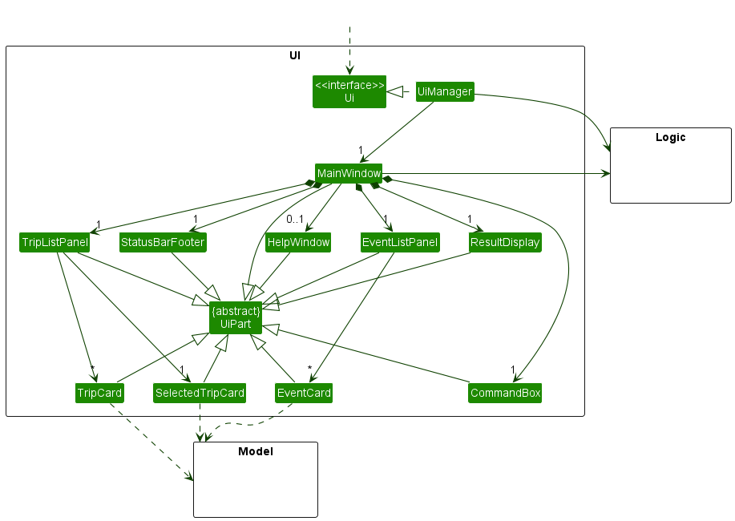
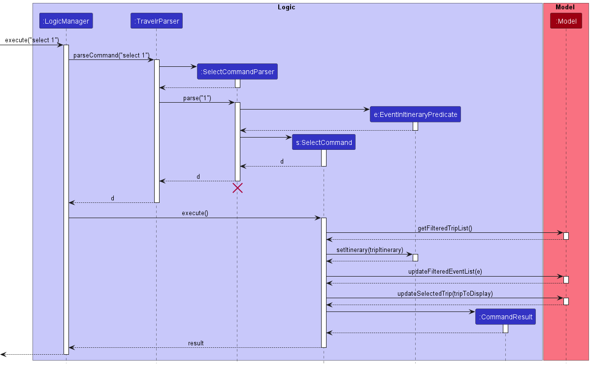
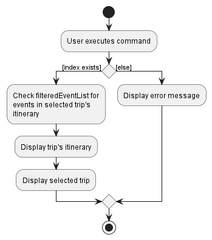
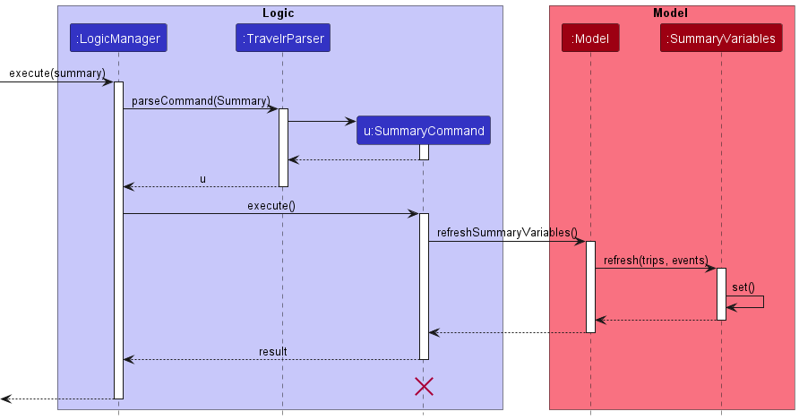
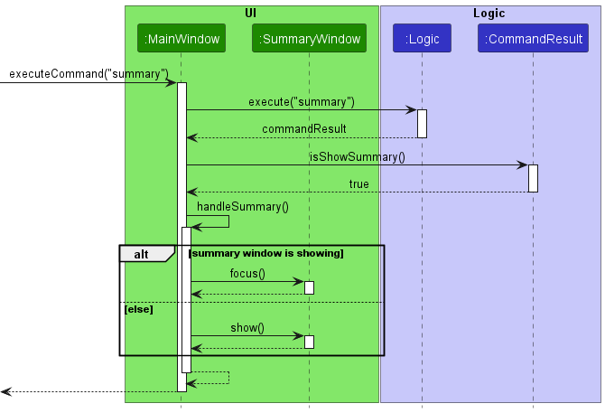

* Table of Contents
{:toc}

--------------------------------------------------------------------------------------------------------------------

## **Acknowledgements**

* {list here sources of all reused/adapted ideas, code, documentation, and third-party libraries -- include links to the original source as well}

--------------------------------------------------------------------------------------------------------------------

## **Setting up, getting started**

Refer to the guide [_Setting up and getting started_](SettingUp.md).

--------------------------------------------------------------------------------------------------------------------

## **Design**

:bulb: **Tip:** The `.puml` files used to create diagrams in this document can be found in the [diagrams](https://github.com/se-edu/addressbook-level3/tree/master/docs/diagrams/) folder. Refer to the [_PlantUML Tutorial_ at se-edu/guides](https://se-education.org/guides/tutorials/plantUml.html) to learn how to create and edit diagrams.

### Architecture

The ***Architecture Diagram*** given above explains the high-level design of the App.

Given below is a quick overview of main components and how they interact with each other.

**Main components of the architecture**

**`Main`** has two classes called [`Main`](https://github.com/se-edu/addressbook-level3/tree/master/src/main/java/seedu/address/Main.java) and [`MainApp`](https://github.com/se-edu/addressbook-level3/tree/master/src/main/java/seedu/address/MainApp.java). It is responsible for,
* At app launch: Initializes the components in the correct sequence, and connects them up with each other.
* At shut down: Shuts down the components and invokes cleanup methods where necessary.

[**`Commons`**](#common-classes) represents a collection of classes used by multiple other components.

The rest of the App consists of four components.

* [**`UI`**](#ui-component): The UI of the App.
* [**`Logic`**](#logic-component): The command executor.
* [**`Model`**](#model-component): Holds the data of the App in memory.
* [**`Storage`**](#storage-component): Reads data from, and writes data to, the hard disk.

**How the architecture components interact with each other**

The *Sequence Diagram* below shows how the components interact with each other for the scenario where the user issues the command `delete 1`, which is used to delete a trip at the specified index.

Each of the four main components (also shown in the diagram above),

* defines its *API* in an `interface` with the same title as the Component.
* implements its functionality using a concrete `{Component Name}Manager` class (which follows the corresponding API `interface` mentioned in the previous point.

For example, the `Logic` component defines its API in the `Logic.java` interface and implements its functionality using the `LogicManager.java` class which follows the `Logic` interface. Other components interact with a given component through its interface rather than the concrete class (reason: to prevent outside component's being coupled to the implementation of a component), as illustrated in the (partial) class diagram below.

The sections below give more details of each component.

### UI component

The **API** of this component is specified in [`Ui.java`](https://github.com/se-edu/addressbook-level3/tree/master/src/main/java/seedu/address/ui/Ui.java)

The UI consists of a `MainWindow` that is made up of parts e.g.`CommandBox`, `ResultDisplay`, `TripListPanel`, `EventListPanel`, `StatusBarFooter` etc. All these, including the `MainWindow`, inherit from the abstract `UiPart` class which captures the commonalities between classes that represent parts of the visible GUI.

The `UI` component uses the JavaFx UI framework. The layout of these UI parts are defined in matching `.fxml` files that are in the `src/main/resources/view` folder. For example, the layout of the [`MainWindow`](https://github.com/se-edu/addressbook-level3/tree/master/src/main/java/seedu/address/ui/MainWindow.java) is specified in [`MainWindow.fxml`](https://github.com/se-edu/addressbook-level3/tree/master/src/main/resources/view/MainWindow.fxml)

The `UI` component,

* executes user commands using the `Logic` component.
* listens for changes to `Model` data so that the UI can be updated with the modified data.
* keeps a reference to the `Logic` component, because the `UI` relies on the `Logic` to execute commands.
* depends on some classes in the `Model` component, as it displays `Trip` and `Event` objects residing in the `Model`.

### Logic component

**API** : [`Logic.java`](https://github.com/AY2223S1-CS2103T-W17-1/tp/blob/master/src/main/java/seedu/travelr/logic/Logic.java)

Here's a (partial) class diagram of the `Logic` component:

How the `Logic` component works:
1. When `Logic` is called upon to execute a command, it uses the `TravelrParser` class to parse the user command.
1. This results in a `Command` object (more precisely, an object of one of its subclasses e.g., `AddCommand`) which is executed by the `LogicManager`.
1. The command can communicate with the `Model` when it is executed (e.g. to add a person).
1. The result of the command execution is encapsulated as a `CommandResult` object which is returned back from `Logic`.

The Sequence Diagram below illustrates the interactions within the `Logic` component for the `execute("delete 1")` API call.

:information_source: **Note:** The lifeline for `DeleteCommandParser` should end at the destroy marker (X) but due to a limitation of PlantUML, the lifeline reaches the end of diagram.

Here are the other classes in `Logic` (omitted from the class diagram above) that are used for parsing a user command:

How the parsing works:
* When called upon to parse a user command, the `TravelrParser` class creates an `XYZCommandParser` (`XYZ` is a placeholder for the specific command title e.g., `AddCommandParser`) which uses the other classes shown above to parse the user command and create a `XYZCommand` object (e.g., `AddCommand`) which the `TravelrParser` returns back as a `Command` object.
* All `XYZCommandParser` classes (e.g., `AddCommandParser`, `DeleteCommandParser`, ...) inherit from the `Parser` interface so that they can be treated similarly where possible e.g, during testing.

### Model component
**API** : [`Model.java`](https://github.com/AY2223S1-CS2103T-W17-1/tp/blob/master/src/main/java/seedu/travelr/model/Model.java)

The `Model` component,

* stores the Travelr data i.e., 
  - all `Trip` objects (which are contained in a `UniqueTripList` object)
  - all `Event` objects (which are contained in a `UniqueEventList` object)
* stores the currently 'selected' `Trip` objects (e.g., results of a search query) as a separate _filtered_ list which is exposed to outsiders as an unmodifiable `ObservableList<Trip>` that can be 'observed' e.g. the UI can be bound to this list so that the UI automatically updates when the data in the list change.
* stores the currently 'selected' `Event` objects (e.g., results of a search query) as a separate _filtered_ list which is exposed to outsiders as an unmodifiable `ObservableList<Event>` that can be 'observed' e.g. the UI can be bound to this list so that the UI automatically updates when the data in the list change.
* stores a `UserPref` object that represents the user’s preferences. This is exposed to the outside as a `ReadOnlyUserPref` objects.
* does not depend on any of the other three components (as the `Model` represents data entities of the domain, they should make sense on their own without depending on other components)

### Storage component

**API** : [`Storage.java`](https://github.com/se-edu/addressbook-level3/tree/master/src/main/java/seedu/address/storage/Storage.java)

The `Storage` component,
* can save both Travelr data and user preference data in json format, and read them back into corresponding objects.
* inherits from both `TravelrStorage` and `UserPrefsStorage`, which means it can be treated as either one (if only the functionality of only one is needed).
* depends on some classes in the `Model` component (because the `Storage` component's job is to save/retrieve objects that belong to the `Model`)

### Common classes

Classes used by multiple components are in the `seedu.travelr.commons` package.

--------------------------------------------------------------------------------------------------------------------

## **Implementation**

This section describes some noteworthy details on how certain features are implemented.

### \[Proposed\] Undo/redo feature

#### Proposed Implementation

The proposed undo/redo mechanism is facilitated by `VersionedAddressBook`. It extends `AddressBook` with an undo/redo history, stored internally as an `addressBookStateList` and `currentStatePointer`. Additionally, it implements the following operations:

* `VersionedAddressBook#commit()` — Saves the current address book state in its history.
* `VersionedAddressBook#undo()` — Restores the previous address book state from its history.
* `VersionedAddressBook#redo()` — Restores a previously undone address book state from its history.

These operations are exposed in the `Model` interface as `Model#commitAddressBook()`, `Model#undoAddressBook()` and `Model#redoAddressBook()` respectively.

Given below is an example usage scenario and how the undo/redo mechanism behaves at each step.

Step 1. The user launches the application for the first time. The `VersionedAddressBook` will be initialized with the initial address book state, and the `currentStatePointer` pointing to that single address book state.

Step 2. The user executes `delete 5` command to delete the 5th person in the address book. The `delete` command calls `Model#commitAddressBook()`, causing the modified state of the address book after the `delete 5` command executes to be saved in the `addressBookStateList`, and the `currentStatePointer` is shifted to the newly inserted address book state.

Step 3. The user executes `add n/David …​` to add a new person. The `add` command also calls `Model#commitAddressBook()`, causing another modified address book state to be saved into the `addressBookStateList`.

:information_source: **Note:** If a command fails its execution, it will not call `Model#commitAddressBook()`, so the address book state will not be saved into the `addressBookStateList`.

Step 4. The user now decides that adding the person was a mistake, and decides to undo that action by executing the `undo` command. The `undo` command will call `Model#undoAddressBook()`, which will shift the `currentStatePointer` once to the left, pointing it to the previous address book state, and restores the address book to that state.

:information_source: **Note:** If the `currentStatePointer` is at index 0, pointing to the initial AddressBook state, then there are no previous AddressBook states to restore. The `undo` command uses `Model#canUndoAddressBook()` to check if this is the case. If so, it will return an error to the user rather
than attempting to perform the undo.

The following sequence diagram shows how the undo operation works:

:information_source: **Note:** The lifeline for `UndoCommand` should end at the destroy marker (X) but due to a limitation of PlantUML, the lifeline reaches the end of diagram.

The `redo` command does the opposite — it calls `Model#redoAddressBook()`, which shifts the `currentStatePointer` once to the right, pointing to the previously undone state, and restores the address book to that state.

:information_source: **Note:** If the `currentStatePointer` is at index `addressBookStateList.size() - 1`, pointing to the latest address book state, then there are no undone AddressBook states to restore. The `redo` command uses `Model#canRedoAddressBook()` to check if this is the case. If so, it will return an error to the user rather than attempting to perform the redo.

Step 5. The user then decides to execute the command `list`. Commands that do not modify the address book, such as `list`, will usually not call `Model#commitAddressBook()`, `Model#undoAddressBook()` or `Model#redoAddressBook()`. Thus, the `addressBookStateList` remains unchanged.

Step 6. The user executes `clear`, which calls `Model#commitAddressBook()`. Since the `currentStatePointer` is not pointing at the end of the `addressBookStateList`, all address book states after the `currentStatePointer` will be purged. Reason: It no longer makes sense to redo the `add n/David …​` command. This is the behavior that most modern desktop applications follow.

The following activity diagram summarizes what happens when a user executes a new command:

#### Design considerations:

**Aspect: How undo & redo executes:**

* **Alternative 1 (current choice):** Saves the entire address book.
  * Pros: Easy to implement.
  * Cons: May have performance issues in terms of memory usage.

* **Alternative 2:** Individual command knows how to undo/redo by
  itself.
  * Pros: Will use less memory (e.g. for `delete`, just save the person being deleted).
  * Cons: We must ensure that the implementation of each individual command are correct.

_{more aspects and alternatives to be added}_

### \[Implemented\] Display trip's events

#### Implementation
The proposed display trip's events mechanism is facilitated by the use of `EventInItineraryPredicate`.
It extends `Predicate` with a test that checks if an event is part of the given Itinerary, which is stored
interally as an `Itinerary`. This predicate is then set as the predicate of the `filteredEventList`, which
contains all events added to Travelr.

Given below is an example usage scenario of how the display trip's events mechanism behaves at each step.

Step 1. The user launches the application for the first time. The `TravelrBook` will be initialised with the
sample Travelr data.

Step 2. The user executes `add n/Trip to Japan ...` to add a new trip, and also executes `add-e n/Try Takoyakis ...`
to add a new event to Travelr.

Step 3. The user adds the `Event` 'Try Takoyakis' to the `Trip` titled 'Trip to Japan', which results in 'Try Takoyakis'
being in its `Itinerary`.

Step 4. The user executes the `select 1` command to display the 1st trip's events.
A new `EventInItineraryPredicate` will be created, with an internal `Itinerary` pointer that points to the `Itinerary`
of the selected `Trip`. `Model#updateFileredEvents` will then be called with the predicate supplied as an argument,
which will update the list of displayed events to be those that are part of the selected trip's itinerary.

:information_source: **Note:** If the selected  fails its execution, it will not call `Model#commitAddressBook()`, so the address book state will not be saved into the `addressBookStateList`.

The following sequence diagram shows how the select operation works:

The following activity diagram summarizes what happens when a user executes a new command:

#### Design considerations:

**Aspect: How select executes:**

{more aspects and alternatives to be added}

### \[Implemented\] Display completed trips and events

#### Implementation
The display completed trips and events mechanism is facilitated by the use of `EventCompletedPredicate`
and `TripCompletedPredicate`. `TripCompletedPredicate` and `EventCompletedPredicate` extends `Predicate` with
a test that checks if an event is part of a list of itineraries belonging to completed trips.

These predicates are then set as the predicate of the `filteredTripList` and `filteredEventList` respectively, which will result
in the display of completed trips and events.

Given below is an example usage scenario of how the display trip's events mechanism behaves at each step.

Step 1. The user launches the application for the first time. `Travelr` will be initialised with the
initial Travelr book state.

Step 2. The user executes `add n/Trip to Japan ...` to add a new trip, and also executes `add-e n/Try Takoyakis ...`
to add a new event to Travelr.

Step 3. The user adds the `Event` 'Try Takoyakis' to the `Trip` titled 'Trip to Japan', which results in 'Try Takoyakis'
being in its `Itinerary`.

Step 4. The user executes `mark 1`, which marks the first trip as well as the events in its itinerary as completed.

Step 5. The user executes `completed`, which displays all completed trips and events, which includes both 'Trip to Japan'
and 'Try Takoyakis'.

The following sequence diagram shows how the completed command works:

### \[Implemented\] Display Travelr Summary Window
#### Implementation

The summary command is facilitated by `SummaryVariables`. It contains several fields which are the `property` representing statistics of the Travelr app that will displayed to the user in the Summary Window.

Here are some key properties 
* `tripsProgress` --- A `SimpleStringProperty` which has a `String` value representing the percentage of trips completed.
* `eventsProgress` --- A `SimpleStringProperty` which has a `String` value representing the percentage of trips completed.
* `totalUniqueLocations` --- A `SimpleIntegerProperty` which has an `Integer` value representing the total unique locations a User visited.

These methods added to the `ModelManager` helps to manage the `SummaryVariables`.

* `ModelManager#getSummaryVariables()` — Returns the `SummaryVariables` stored in the `ModelManager`.
* `ModelManager#refreshSummaryVariables()` — Refreshes the `SummaryVariables`.

Given below is an example usage scenario and how the summary mechanism behaves at each step.

Step 1. The user launches the application for the first time. The `Travelr` will be initialized with the initial Travelr state, with no trips or events added.

Step 2. The user executes `add n/Trip Name ...` to add a new trip, and `add-e n/Event Name ...` to add a new event. Throughout the usage of the app, the user adds multiple trips and events to Travelr, and also uses `add-et n/Event Name t/Trip Name ...` to add events to trips. 

Step 3. The user now completes a `Trip` and marks it as completed using the `mark` command. Throughout the usage of the app, the user `mark` multiple trips as he carries out his trips.

Step 4. The user now decides that he wants to see a summary of his travels, and he does so using the `summary` command. The `summary` command will call `Model#refreshSummaryVariables()`,  which calls `SummaryVariables#refresh()` to get new updates for the summary variables and the list of completed trips.

The following sequence diagram shows how the summary command works:

:information_source: **Note:** The lifeline for `UndoCommand` should end at the destroy marker (X) but due to a limitation of PlantUML, the lifeline reaches the end of diagram.

Step 5. Now that the `SummaryVariables` are refreshed, the GUI will display a new window through `MainWindow#handleSummary`.

The following sequence diagram shows how the GUI displays the Summary Window:

#### Design considerations:

**Aspect: How summary executes:**

* **Alternative 1 (current choice):** Show new window.
  * Pros: Easy to implement.
  * Cons: Poorer user experience from having to change windows.

* **Alternative 2:** Overlay the summary panel over the trips and events panel in the main window.
  * Pros: Easier for users to see the summary information from one window.
  * Cons: We must ensure that the implementation of each individual command are correct.

### \[Proposed\] Data archiving

_{Explain here how the data archiving feature will be implemented}_

--------------------------------------------------------------------------------------------------------------------

## **Documentation, logging, testing, configuration, dev-ops**

* [Documentation guide](Documentation.md)
* [Testing guide](Testing.md)
* [Logging guide](Logging.md)
* [Configuration guide](Configuration.md)
* [DevOps guide](DevOps.md)

--------------------------------------------------------------------------------------------------------------------

## **Appendix: Requirements**

### Product scope

**Target user profile**:

* has a need to keep track of their bucket lists
* wants to manage travel itineraries, bookings, and costs efficiently
* prefer desktop apps over other types
* can type fast
* prefers typing to mouse interactions
* is reasonably comfortable using CLI apps

**Value proposition**: manage trips itineraries, bookings, and costs faster than a typical mouse/GUI driven app.

### User stories

Priorities: High (must have) - `* * *`, Medium (nice to have) - `* *`, Low (unlikely to have) - `*`

| Priority | As a …​                            | I want to …​                    | So that I can…​                                         |
|----------|------------------------------------|---------------------------------|---------------------------------------------------------|
| `* * *`  | user                               | add events and trips            | keep track of what I want to do                         |
| `* * *`  | user                               | view all the events in the list | refer to it whenever I want                             |
| `* * *`  | user                               | save events into local storage  | access the data whenever I want                         |
| `* * *`  | user                               | delete events and trips         | remove the unwanted event and trips                     |
| `* *`    | user                               | hide private contact details    | minimize chance of someone else seeing them by accident |
| `* *`    | user who often change his/her mind | update the details              | easily change things                                    |
| `* *`    | user                               | categorize my events            | keep track of each category                             |
| `*`      | user                               | reuse past itineraries          | use it when I want to                                   |
| `*`      | user                               | view the total budget needed    | keep track of the budget                                |

*{More to be added}*

### Use Cases
Software System: Travelr

**Use case: UC01 Delete a Trip**

**Actor: User**

**MSS :**
1. User request the list of trips
2. Travelr lists the trips.
3. User requests to delete a certain trip.
4. Travelr deletes the specified trip.

   Use case ends

**Extensions:**

* 2a. The list is empty.

  Use case ends.
* 3a. The requested trip doesn't exist
    * 3a1. Travelr shows an error message.

      Use case ends

* 3b. Invalid input
    * 3b1. Travelr shows an error message.

      Use Case Ends

Software System: Travelr

**Use case: UC02 Select a Trip**

**Actor: User**

**MSS :**
1. User request the list of trips
2. Travelr lists the trips.
3. User requests to select a certain trip.
4. Travelr selects the specified trip.
5. Travelr lists the events contained in the trip.

   Use case ends

**Extensions:**

* 2a. The list is empty.

  Use case ends.
* 3a. The requested trip doesn't exist
    * 3a1. Travelr shows an error message.

      Use case ends

* 3b. Invalid input
    * 3b1. Travelr shows an error message.

      Use Case Ends

**Use case: UC03 Assign an Event to a Trip**

**Actor: User**

**MSS :**
1. User request the list of trips and bucketList events
2. Travelr lists the trips and events.
3. User requests to move the specified event to the specified trip.
4. Travelr move the specified event to the trip.

   Use case ends

**Extensions:**

* 2a. The list or bucketList is empty.

  Use case ends.
* 3a. The requested trip doesn't exist
    * 3a1. Travelr shows an error message.

      Use case ends

* 3b. Invalid input
    * 3b1. Travelr shows an error message.

      Use Case Ends
* 3c. The requested event doesn't exist
    * 3b1. Travelr shows an error message.

      Use Case Ends

**Use case: UC04 Remove an Event from a Trip**

**Actor: User**

**MSS :**
1. User request the list of events in a trip.
2. Travelr lists the events in the trip.
3. User requests to move the specified event from the specified trip.
4. Travelr move the specified event from the trip to the bucketList.

   Use case ends

**Extensions:**

* 2a. There is no events in the trip.

  Use case ends.
* 3a. The requested trip doesn't exist
    * 3a1. Travelr shows an error message.

      Use case ends

* 3b. Invalid input
    * 3b1. Travelr shows an error message.

      Use Case Ends
* 3c. The requested event doesn't exist
    * 3b1. Travelr shows an error message.

      Use Case Ends

**Use case: UC05 Mark a trip as done**

**Actor: User**

**MSS :**
1. User request the list of trips.
2. Travelr lists trips.
3. User requests mark a trip as done.
4. Travelr marks the trip as done.

   Use case ends

**Extensions:**

* 2a. There is trip list is empty.

  Use case ends.
* 3a. The requested trip doesn't exist
    * 3a1. Travelr shows an error message.

      Use case ends

* 3b. Invalid input
    * 3b1. Travelr shows an error message.

      Use Case Ends
* 4a. The trip is already marked as done.

  Use case ends.

**Use case: UC06 Mark a trip as not done**

**Actor: User**

**MSS :**
1. User request the list of trips.
2. Travelr lists trips.
3. User requests to mark a trip as not done.
4. Travelr marks the trip as not done.

   Use case ends

**Extensions:**

* 2a. The trip list is empty.  
  Use case ends.
* 3a. The requested trip doesn't exist
    * 3a1. Travelr shows an error message.

      Use case ends

* 3b. Invalid input
    * 3b1. Travelr shows an error message.

      Use Case Ends
* 4a. The trip is already marked as not done.

  Use case ends.

**Use case: UC07 Delete event**

**Actor: User**

**MSS :**
1. User request the list of events in bucket list.
2. Travelr lists events in bucket list.
3. User request to delete an event from the bucket list.
4. Travelr deletes the event.

   Use case ends

**Extensions:**

* 2a. Bucket list is empty.  
  Use case ends.

* 3a. The requested event doesn't exist

    * 3a1. Travelr shows an error message.  
      Use case ends

* 3b. Invalid input
    * 3b1. Travelr shows an error message.  
      Use Case Ends

**Use case: UC08 Sort trips**

**Actor: User**

**MSS :**
1. User request the list of trips.
2. Travelr lists trips in UniqueTripList.
3. User request to sort the list of trips.
4. Travelr sorts the trips according to the user's request.

   Use case ends

**Extensions:**

* 2a. UniqueTripList is empty.  
  Use case ends.

* 3a. The requested sorting factor does not exist

    * 3a1. Travelr shows an error message.  
      Use case ends

* 3b. Invalid input
    * 3b1. Travelr shows an error message.  
      Use Case Ends

**Use case: UC09 Show completed trips and events**

**Actor: User**

**MSS :**
1. User requests to see the trips they have completed as well as the events in these completed trips.
2. Travelr lists trips user has completed as well as the events in these trips.

   Use case ends
  
**Use case: UC10 Show summary**

**Actor: User**

**MSS :**
1. User requests to see a summary of all their trips and events in Travelr.
2. Travelr displays a summary of the user's trips and events.

   Use case ends

### Non-Functional Requirements

1.  Should work on any _mainstream OS_ as long as it has Java `11` or above installed.
2.  Should be able to hold up to 2000 events without a noticeable sluggishness in performance for typical usage.
3.  A user with above average typing speed for regular English text (i.e. not code, not system admin commands) should be able to accomplish most of the tasks faster using commands than using the mouse.
4.  The UI should be resizable as users will likely be referencing other tabs while using this product.
5.  Should respond immediately to user input, as user will likely be using multiple commands.
6.  Should be usable by novice travelers that have never planned a trip.
7.  Should be able to work offline

### Glossary

* **Mainstream OS**: Windows, Linux, Unix, OS-X
* **UI**: The User Interface that users will see when they use the product.

--------------------------------------------------------------------------------------------------------------------

## **Appendix: Instructions for manual testing**

Given below are instructions to test the app manually.

:information_source: **Note:** These instructions only provide a starting point for testers to work on;
testers are expected to do more *exploratory* testing.

### Launch and shutdown

1. Initial launch

   1. Download the jar file and copy into an empty folder

   1. Double-click the jar file Expected: Shows the GUI with a set of sample trips and events. The window size may not be optimum.

1. Saving window preferences

   1. Resize the window to an optimum size. Move the window to a different location. Close the window.

   1. Re-launch the app by double-clicking the jar file. 
       Expected: The most recent window size and location is retained.

### Deleting a trip

1. Deleting a trip while all trips are being shown

   1. Prerequisites: List all trips using the `list` command. Multiple trips in the list.

   1. Test case: `delete 1` 
      Expected: First trip is deleted from the list. Details of the deleted trip is shown in the status message. Events in the deleted trip are returned to the bucket list.

   1. Test case: `delete 0` 
      Expected: No trip is deleted. Error details shown in the status message.

   1. Other incorrect delete commands to try: `delete`, `delete x`, `...` (where x is larger than the list size) 
      Expected: Similar to previous.

### Saving data
Travelr data are saved locally automatically after any command.
1. Test case: Data folder is missing
   1. On app launch, if no data folder is detected, a new Travelr instance with sample data will be used. 
   1. Run any command and a new data folder containing a travelr.json file will be generated.
   1. If you do not run any command and quit the app, no data folder or file will be generated.
1. Test case: travelr.json file is missing
   1. On app launch, if there is a data folder but it is empty, a new Travelr instance with sample data will be used.
   1. Run any command and a new travelr.json file will be generated in the data folder.
   1. If you do not run any command and quit the app, no file will be generated.
1. Test case: Data file is corrupted i.e does not follow the correct format
   1. On app launch, if travelr.json file is corrupted, a new Travelr instance with no data will be used.
   1. Run any command and the contents of the travelr.json file will be overwritten to contain the new data, which is of a correct format.
   1. If you do not run any command and quit the app, no changes will be made to the travelr.json file.

