* Table of Contents 
{:toc}

--------------------------------------------------------------------------------------------------------------------
Travelr allows you to plan trips around the activities in your bucket list. You will be able to keep track of your bucket list, travel dates, locations, and itineraries, all within the same app!

In this guide, you will be introduced to the various features of Travelr, which will help you to use Travelr to build up your bucket list, plan future trips, and look back on your past trip experiences in an effective manner.

--------------------------------------------------------------------------------------------------------------------
## Quick start

1. Ensure you have Java `11` or above installed in your Computer.
2. Download the latest `Travelr.jar` [here](https://github.com/AY2223S1-CS2103T-W17-1/tp/releases).
3. Copy the file to the folder you want to use as the _home folder_ for Travelr.
4. Double-click the file to start the app. The GUI should appear in a few seconds, and will look similar to the screenshot below. Note how the app contains some sample data. 
   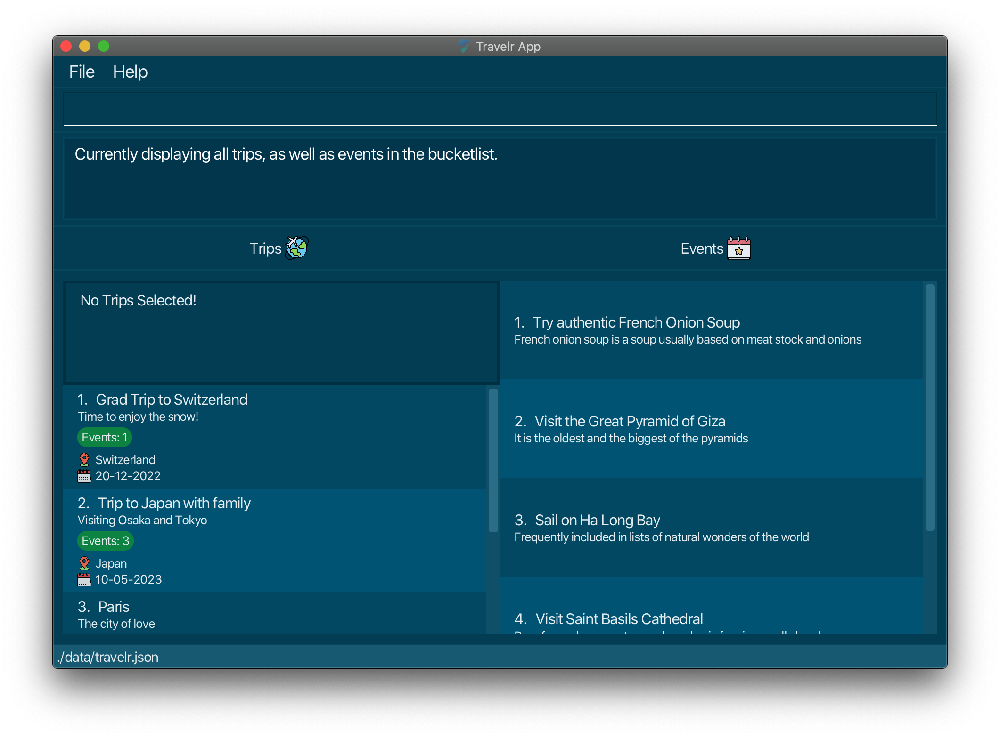
5. Type the command in the input box and press Enter to execute it. e.g. typing **`help`** and pressing Enter will open the help window. 
   Some example commands you can try:

   * `list-e` : Lists all events.

   * `add-e n/Sightseeing d/Visit Mountains` : Adds an event with the respective title and description into your event list.

   * `delete-e 3` : Deletes the 3rd event shown in the current event list.

   * `exit` : Exits the app.
6. Refer to the [Features](#features) below for details of each command.

--------------------------------------------------------------------------------------------------------------------

## Parts of our GUI
**Notes about the UI:**

On app startup, the Trip List Display will show all trips and the Event List Display will display
the events in the bucket list i.e Events that haven't been added to any trips.

Trips can be marked as completed via the [`mark`](#marking-trips-as-completed-mark) command. Completed trips will be labelled with a tick icon
to the right of the trip's title.

The trips display sorts the trips by completion automatically. Completed trips will remain at the bottom of the list.

Titles, locations and descriptions that are too long will be truncated. To view the full details of an event or trip, use [`display-e`](#displaying-specified-event-details-display-e) and [`display`](#displaying-specified-trip-details-display) commands respectively.

**:information_source: Explanation of our User Interface:** 

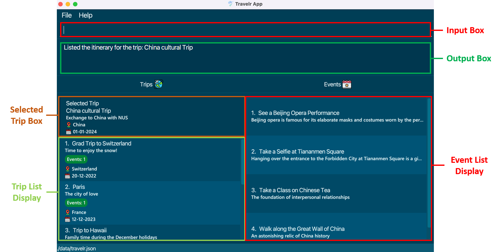
 
|`Component`|`Explanation`|
|:-:|:--|
|**Input Box**|where you enter your commands.|
|**Output Box**|where the results of your command are shown.
   |**Selected Trip Box**| where the current selected trip is shown.   Use [<code>select</code>](#selecting-a-trip-to-view-its-itinerary-select) to select a trip.|
|**Trip List Display** |where the Trips stored in Travelr are shown.   Commands to change the types of trips being shown:  <ul> [<li><code>completed</code></li>](#viewing-all-completed-trips-and-events-completed) [<li><code>view</code></li>](#viewing-all-trips-and-events-view) [<li><code>list</code></li>](#viewing-trips-list-list) </ul> See feature list for more information about the commands.|
|**Event List Display**|where the Events stored in Travelr are shown.   Commands to change the types of events being shown:  <ul>[<li><code>completed</code></li>](#viewing-all-completed-trips-and-events-completed) [<li><code>view</code></li>](#viewing-all-trips-and-events-view) [<li><code>list-e</code></li>](#viewing-bucket-list-list-e) [<li><code>select</code></li>](#selecting-a-trip-to-view-its-itinerary-select) </ul> See feature list for more information about the commands.

--------------------------------------------------------------------------------------------------------------------

## Features

   
**:warning: Notes about the command format:** 

|`Component`|`Formatting Details`|
|:-:|:--|
|**Input**| Words in UPPER_CASE are the inputs to be supplied by the user.   e.g. in `add n/TITLE`, TITLE is an input which can be used as `add n/Switzerland Trip`|
|**Optional Inputs**| Items in square brackets are optional.   e.g `NAME [t/TAG]` can be used as `John Doe t/Friend` or as `John Doe`. |
|**Prefixes**| The relevant prefixes must be used to separate parameters supplied by the user.   e.g. in `add-e n/TITLE d/DESCRIPTION`, `n/`  and `d/` are two designated used to separate the two parameters supplied which can be used as `add-e n/Sightseeing d/Visit mountains`.|
|**Unnecessary inputs** | Unnecessary inputs for commands that do not require inputs (such as `list`) will be ignored.   e.g. if the command specifies `list 123`, it will be interpreted as `list`.|
|**Ordering of inputs**| Inputs can be in any order.   e.g. if the command specifies `n/TITLE d/DESCRIPTION`, `d/DESCRIPTION n/TITLE` is also acceptable.|
|**Multiple inputs**| If an input is expected only once in the command but you specified it multiple times, only the last occurrence of the input will be taken.   e.g. if you specify `n/Singapore Trip n/Malaysia Trip`, only `n/Malaysia Trip` will be taken.|
|**Case Sensitivity**| `TITLE` is case-sensitive, so titles with the same letters and spacing but different capitalizations will be considered different. This applies for both events and trips. This is done in order to allow for the differentiation of words with different meanings when different capitalizations are used.  e.g. Two different trips with titles `December Turkey trip` and `December turkey trip` may refer to two different trips, where the former refers to a trip to Turkey, while the latter refers to a trip that involves the consumption of turkey.|
|**Duplicates**| Events with the same title are considered duplicates, and duplicate events are not allowed.   Trips with the same title are considered duplicates, and duplicate trips are not allowed.|

### Managing Events

#### Adding events: `add-e`
Adds an event to the bucket list.

Format: `add-e n/TITLE d/DESCRIPTION`

   
**:point_up: Use case:**  

Have something new to add to your bucket list? Use the <code>add-e</code> to add a new event to your bucket list! 
      

Examples:
- `add-e n/Skydiving d/Skydiving with crew`
- `add-e n/Sailing d/Sail in the Danube River`

The following is an example of how the `add-e` command can be run in the GUI. 

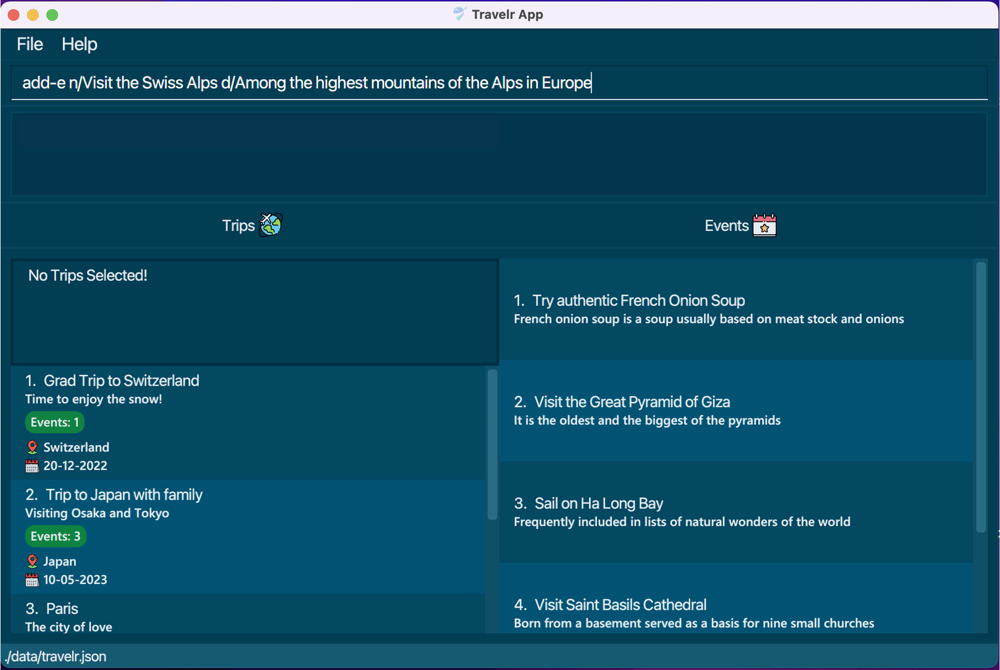

After the event has been successfully added, a confirmation message will be shown in the output box. You will also be able to see your new event in the event list display as seen below.

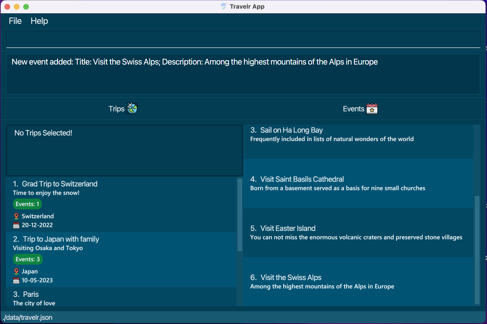
   

#### Viewing bucket list: `list-e`
Shows a list of all events present in the bucket list.

Format: `list-e`

#### Deleting events: `delete-e`
Deletes the specified event from the bucket list.

Format: `delete-e INDEX`
- Deletes the event at the specified INDEX.
- The index refers to the index number shown in the bucket list.
- The index must be a positive integer 1, 2, 3, …

Examples:
- `delete-e 2` deletes the 2nd event in the bucket list.

#### Displaying specified event details: `display-e`
Displays the full title, description of the event at the specified INDEX of the displayed events list in the output box.

Format: `display-e INDEX`

   
**:point_up: Use case:**  

Occasionally, you may add events with titles or descriptions that are too long, which leads to these information being truncated in the UI. To view the truncated information, you can use the <code>display-e</code> command to look at a specified event's full title and description.

The following is an example of how the `display-e` command can be run in the GUI.

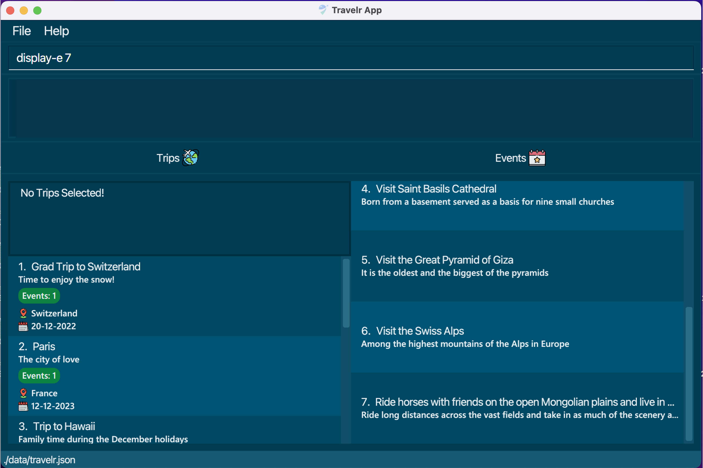

After the command has been successfully executed, a full description of the specified event will be shown in the output box as seen below.

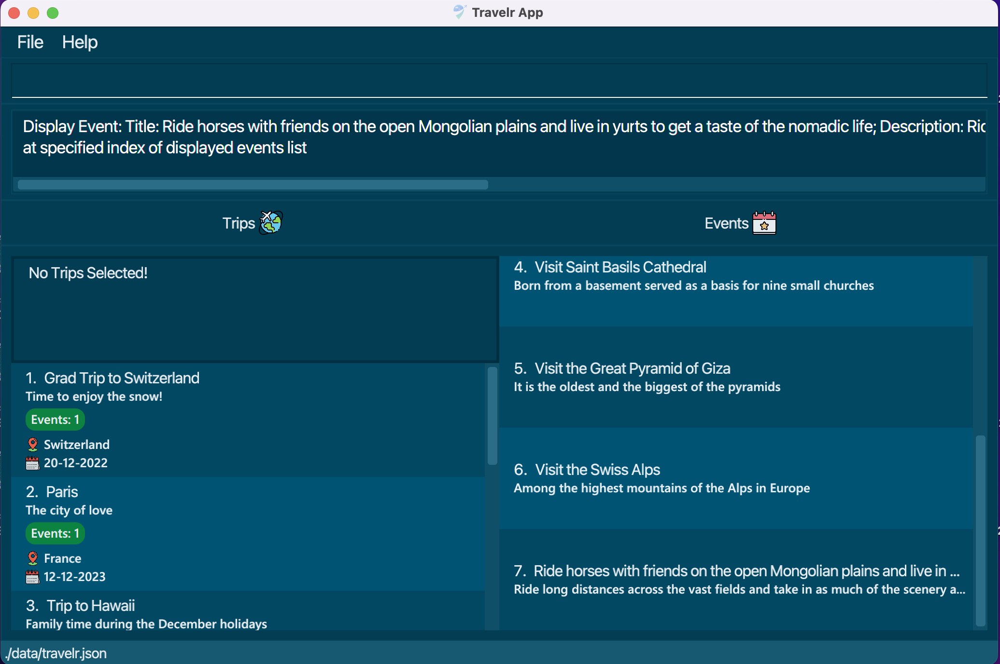
   

### Managing Trips

#### Adding trips: `add`
Adds a trip to the trip list.

Format: `add n/TITLE d/DESCRIPTION l/LOCATION D/DATE`
- All fields are compulsory.
- Date must follow the format `dd-mm-yyyy`.

   
**:point_up: Use case:**  
   
Planning an upcoming trip? Use the `add` command to add a new trip to your trip list!

Examples:
- `add n/Trip to Iceland d/Skiing in Iceland l/Iceland D/26-12-2023`

The following is an example of how the `add` command can be run in the GUI.

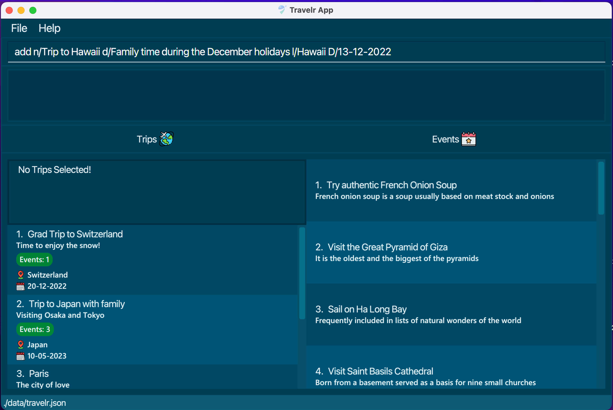

After the trip has been successfully added, a confirmation message will be shown in the output box. You will also be able to see your new trip in the trip list display as seen below.
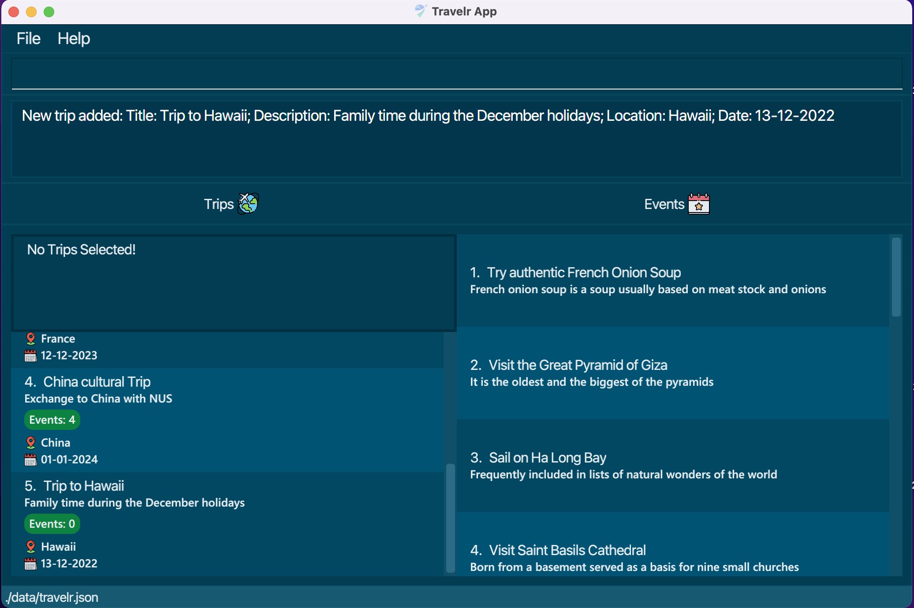
 

#### Viewing trips list: `list`
Shows a list of all trips added.

Format: `list`

#### Deleting trips: `delete`
Deletes a trip at the specified INDEX of the displayed trip list. Events in the deleted trip will be returned to the bucket list.

Format: `delete INDEX`

Examples:
- `delete 1`

#### Displaying specified trip details: `display`

Displays the full title, description, location, and date of the trip at the specified INDEX of the displayed trip list in the output box.
Format: `display INDEX`

   
**:point_up: Use case:**  
   
Occasionally, you may add trips with titles or descriptions that are too long, which leads to these information being truncated in the UI. To view the truncated information, you can use the <code>display</code> command to look at a specified trip's full title and description.

The following is an example of how the `display` command can be run in the GUI.

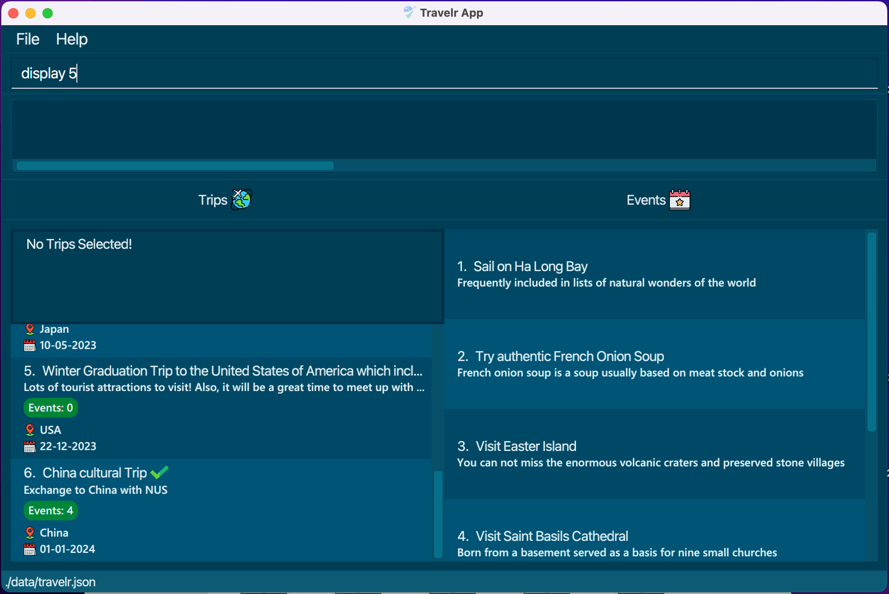

After the command has been successfully executed, a full description of the specified trip will be shown in the output box as seen below.

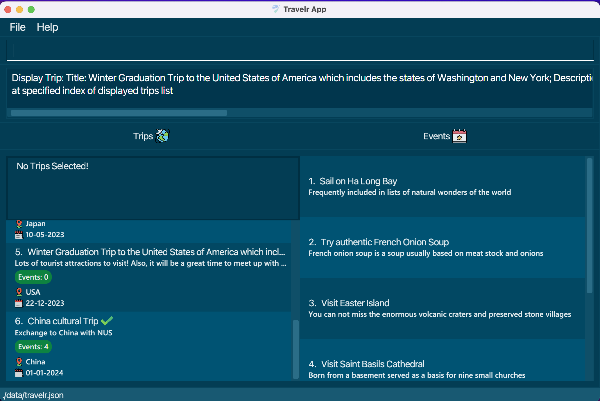
   

### Managing a Trip's Itinerary

#### Adding event to a trip's itinerary: `add-et`
Adds the specified event from the bucket list to the specified trip's itinerary.

Format: `add-et n/EVENT NAME t/TRIP NAME`
- Adds the event with the specified EVENT NAME
- Event is added to the trip at the specified TRIP NAME
- The TRIP NAME must exist in the trips list.
- The EVENT NAME must exist in the events list.

*Note: Event names and trip names are used as inputs instead of indexes to make the command as specific as possible.

   
**:point_up: Use case:**  
   
<code>add-et</code> can be used to help you to plan your trip's itinerary. You can pick and choose any event that exists in your bucket list and add them into a specified trip's itinerary, which you can then view via the `select` command.

Examples:
- `add-et n/Visit the Swiss Alps t/Trip to Switzerland` adds the event titled `Visit the Swiss Alps` in the bucket list to the itinerary of the trip with the title `Trip to Switzerland`.

The following is an example of how the `add-et` command can be run in the GUI.

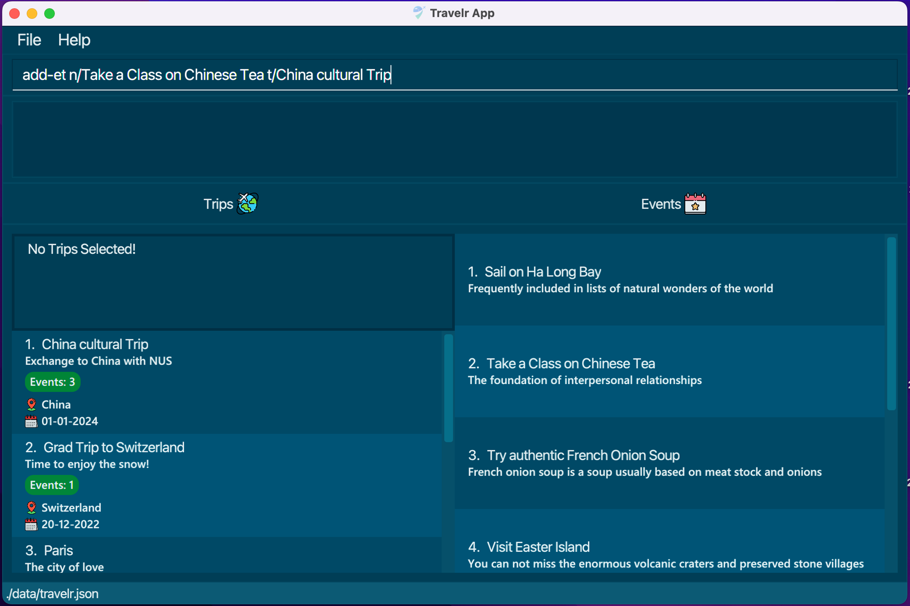

#### Removing event from a trip's itinerary: `delete-et`
Remove the specified event from the specified trip. The event will then be returned to the bucket list.

Format: `delete-et n/EVENT NAME t/TRIP NAME`
- Remove the event with the specified event titled `EVENT NAME` from the specified trip titled `TRIP NAME`
- Event is added to the bucket list.
- The TRIP NAME must exist in the trips list.
- The EVENT NAME must exist in the trip itinerary.

   
**:point_up: Use case:**  
   
Perhaps you have changed your mind about including a particular event in a specified trip's itinerary. You can then use <code>delete-et</code> to remove that event and put it back to your bucket list, where you can save it for future trips. 

Examples:
- `delete-et n/Visit the Swiss Alps t/Trip to Switzerland` remove the event titled `Visit the Swiss Alps` from the itinerary of the trip titled `Trip to Switzerland` and returns it to the bucket list.

#### Selecting a trip to view its itinerary `select`
Selects the trip in the specified INDEX and displays all events added to that trip in the events list panel.

Format: `select INDEX`
- Selects the trip at the specified INDEX.
- The index refers to the index number shown in the current displayed trip list.
- The index must be a positive integer 1, 2, 3, …

   
**:point_up: Use case:**  
   
Now that you have added events into a trip's itinerary, you may want to take a look at how that trip's itinerary looks like. You can run the <code>select</code> command to select a trip and view all the events that have been added its itinerary. 

The following is an example of how the `select` command can be run in the GUI.

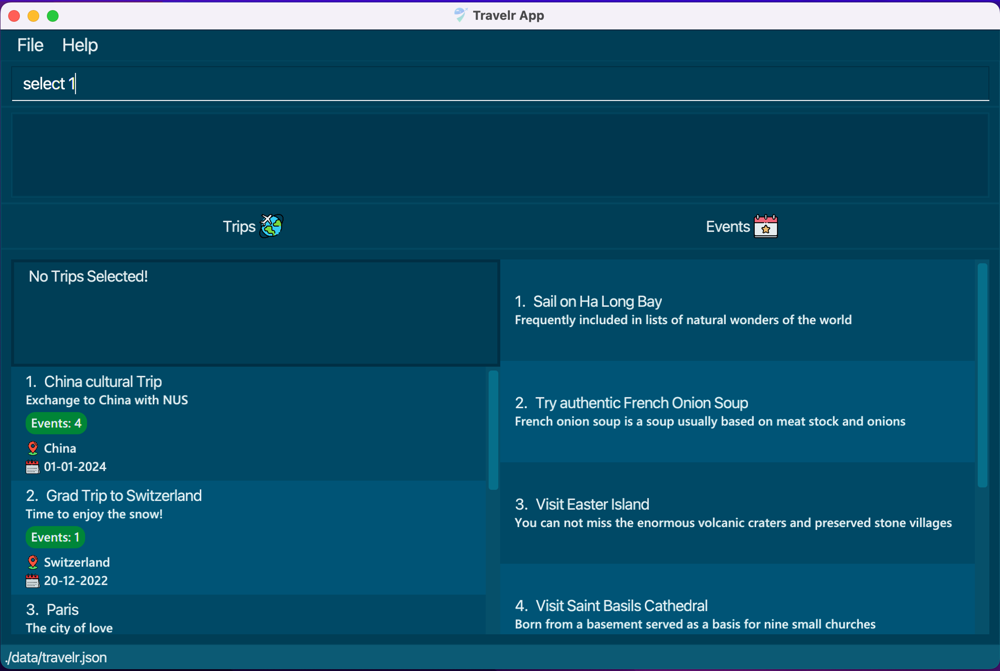

After the trip has been successfully selected, a confirmation message will be shown in the output box. You will be able to see your selected trip in the selected trip box, along with the list of events in its itinerary.

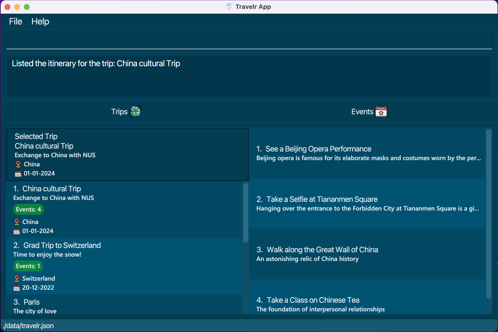
   

### Managing a Trip's Completion Status

#### Marking trips as completed: `mark`
Mark the trip in the specified INDEX as done. After the specified trip has been marked as completed, it will be moved downwards to the set of completed trips in the trip list. 

Format: `mark INDEX`
- Marks the trip at the specified INDEX as done.
- The index refers to the index number shown in the trip list.
- The index must be a positive integer 1, 2, 3, …

   
**:point_up: Use case:**  
   
Congratulations, you have just completed a trip! You can now mark it as completed using the <code>mark</code> command.

Examples:
- `mark 1` marks the first trip in the trip list as done.

The following is an example of how the `mark` command can be run in the GUI.

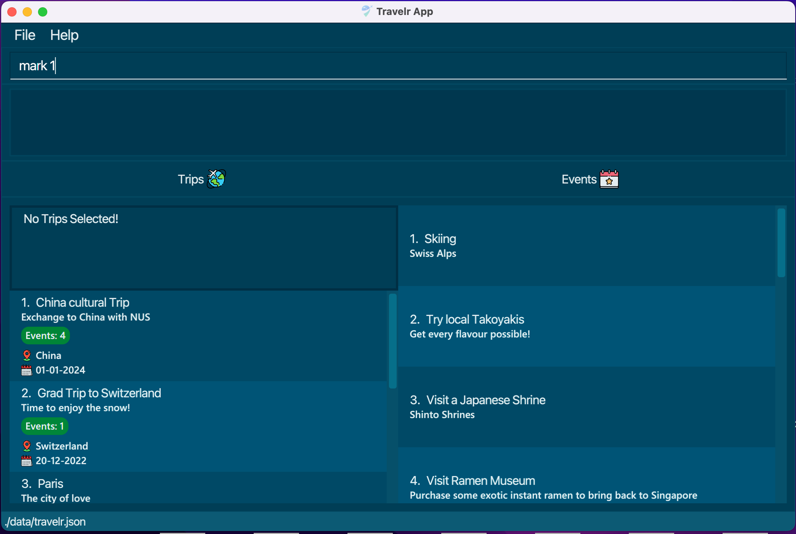

After the trip has been successfully marked, a confirmation message will be shown in the output box. A completed icon will now be displayed beside the title of your completed trip as seen below.

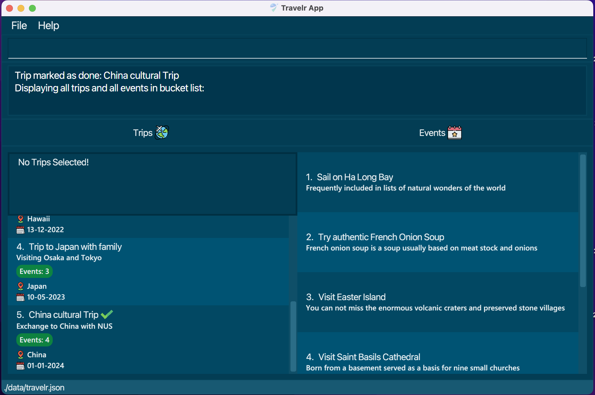

#### Marking trips as incomplete: `unmark`
Mark the trip in the specified INDEX as not done. After the specified trip has been marked as incomplete, it will be moved upwards to the set of incomplete trips in the trip list. 

Format: `unmark INDEX`
- Marks the trip at the specified INDEX as not done.
- The index refers to the index number shown in the trip list.
- The index must be a positive integer 1, 2, 3, …

   
**:point_up: Use case:**  
   
Accidentally marked a trip as completed on accident? Use the <code>unmark</code> command to set it back to incomplete.

Examples:
- `unmark 1` marks the first trip in the trip list as not done.
   

### Sorting

#### Sorting trips: `sort`
Sorts the trips according to the provided factor. 
Note that completed and incomplete trips will be sorted separately, with completed trips
being at the bottom.

Format: `sort [by/FACTOR] [r/]`
- Sorts the trip according to provided FACTOR.
- FACTOR is case-insensitive
- Completed and incomplete trips are sorted separately.
- Order of sort reversed when the `r/` prefix is provided.
- If no parameters are given, the trips will be sorted by their title in alphabetical order by default.
- A valid FACTOR must be provided if the `by/` prefix is provided.
- Extraneous parameters for `r/` prefix will be ignored.

Examples:
- `sort by/time r/` sorts the trip by reversed chronological order.

| FACTOR | Description |
| --- | --- |
| `title` | Sort by trips' title in alphabetical order |
| `time` | Sort by trips' date in chronological order |
| `location` | Sort by trips' location in alphabetical order |
| `eventcount` | Sort by trips' number of events in ascending order |

#### Sorting events within bucketlist: `sort-e`
Sorts all events according to alphabetical order.

Format: `sort-e [r/]`
- Order of sort reversed when the `r/` prefix is provided.
- Extraneous parameters for `r/` prefix will be ignored.

### Overview Display Commands

#### Viewing all completed trips and events: `completed`
Displays all completed trips and events.

Format: `completed`

   
**:point_up: Use case:**  
   
Take a stroll down memory lane and revisit happy memories as a list of all your completed trips and events are shown to you. 

#### Viewing all trips and events: `view`
Displays all trips and events in Travelr. This includes events that are part of the bucket list or events that are part of a trip.

Format: `view`

#### Viewing lifetime summary: `summary`
Displays a summary window of your lifetime travels.

Format: `summary`

- Calculates the number of unique locations you visited.
- Includes list of completed trips.
- Total number of completed trips and events.
- Progress indicator for trips and events.
- Command must be used again to view updates to the summary.

   
**:point_up: Use case:**  
   
How much of your bucket list has been completed? How many countries have you visited thus far? All of your answers can be found via the <code>summary</code> command.

After the command has been successfully executed, a new window will pop up, with information summarising your lifetime travels.

[Summary_Window](images/SummaryScreenshot.png)
 

### General Commands

#### Clearing all entries: `clear`

Clears all entries from Travelr, which includes the trips and the events.

Format: `clear`

#### Viewing help: `help`

Shows a command summary as well as link to the User Guide page. The link can be copied by clicking the `Copy URL` button.

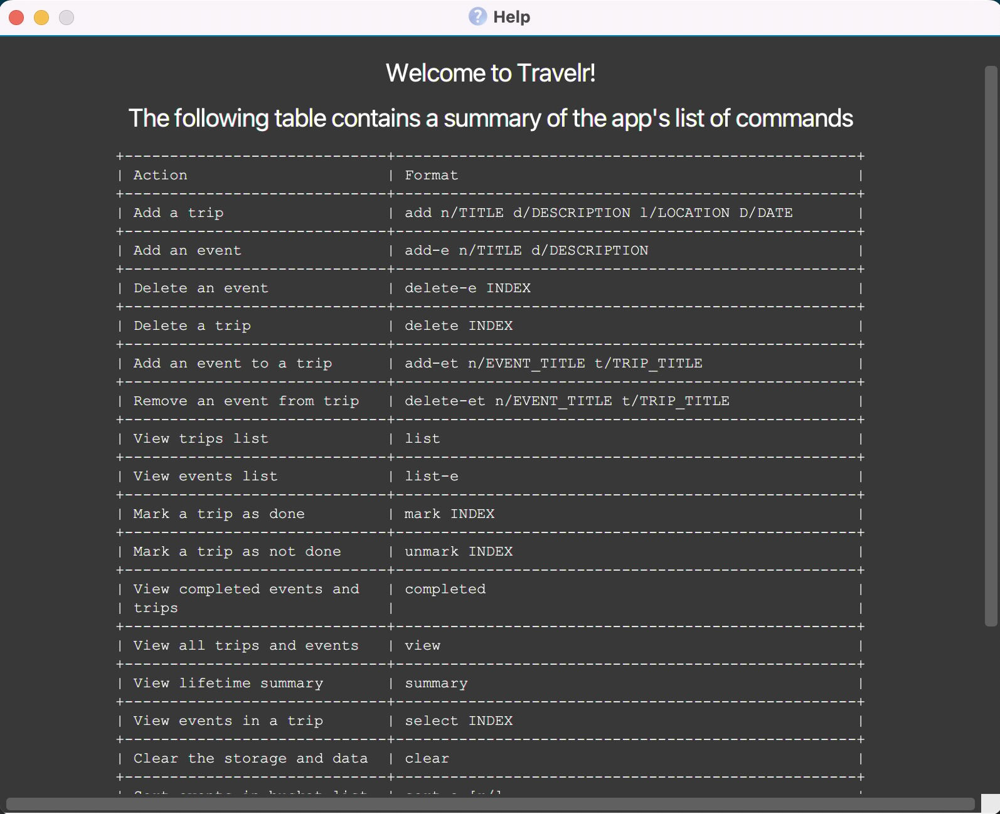

Format: `help`

   
**:point_up: Use case:**  
   
Need help with using Travelr effectively? The <code>help</code> command provides a summarized list of commands that you can try out. 

#### Exiting the program: `exit`
Exits the program.

Format: `exit`

### Saving data
Travelr data are saved locally automatically after any command. There is no need to save manually.

## Glossary

* **Bucket list**: List of events that haven't been added to any trips
* **Displayed events list**: List of events being displayed in the right panel of the UI
* **Displayed trips list**: List of trips being displayed in the left panel of the UI
* **GUI**: Stands for Graphical User Interface, which refers to the user interface that you will be interacting with.

### Icons
|**Icon**|**Explanation**|
|:-:|:-:|
|:information_source:|The segment will provide useful information for using Travelr.|
|:warning:|The segment will provide important notes about Travelr.|
|:point_up:|The segment explains the uses of a feature.|
